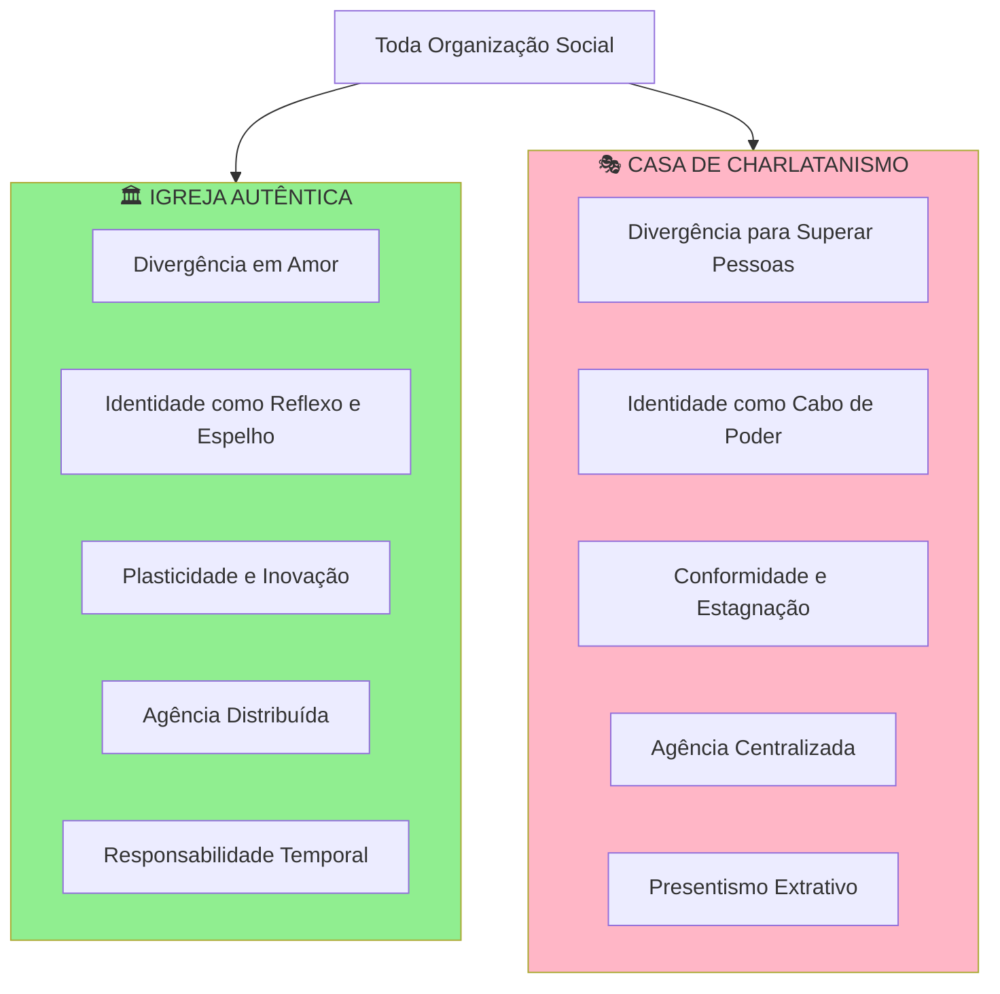
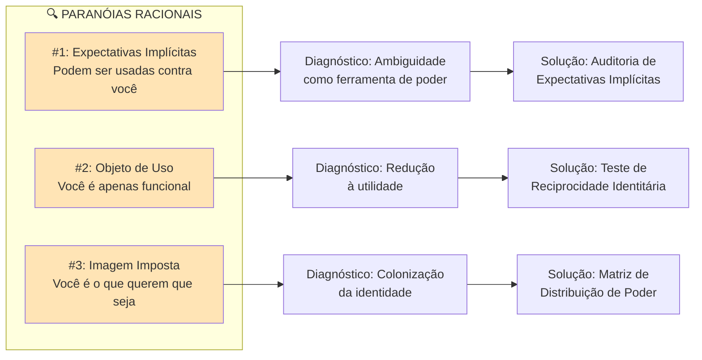
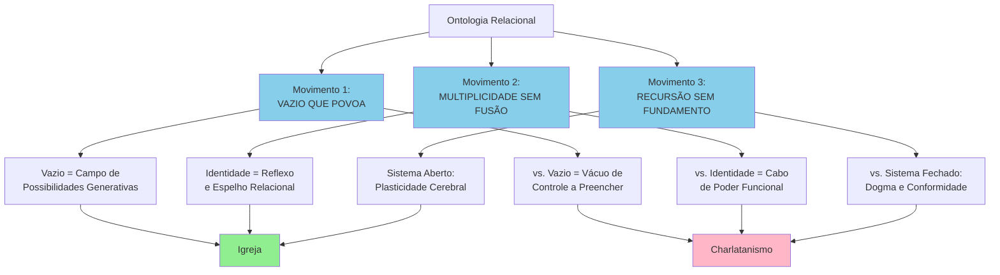
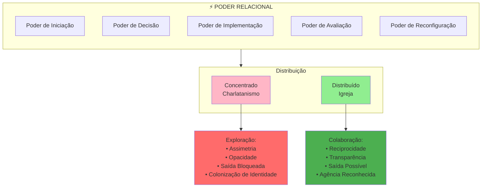
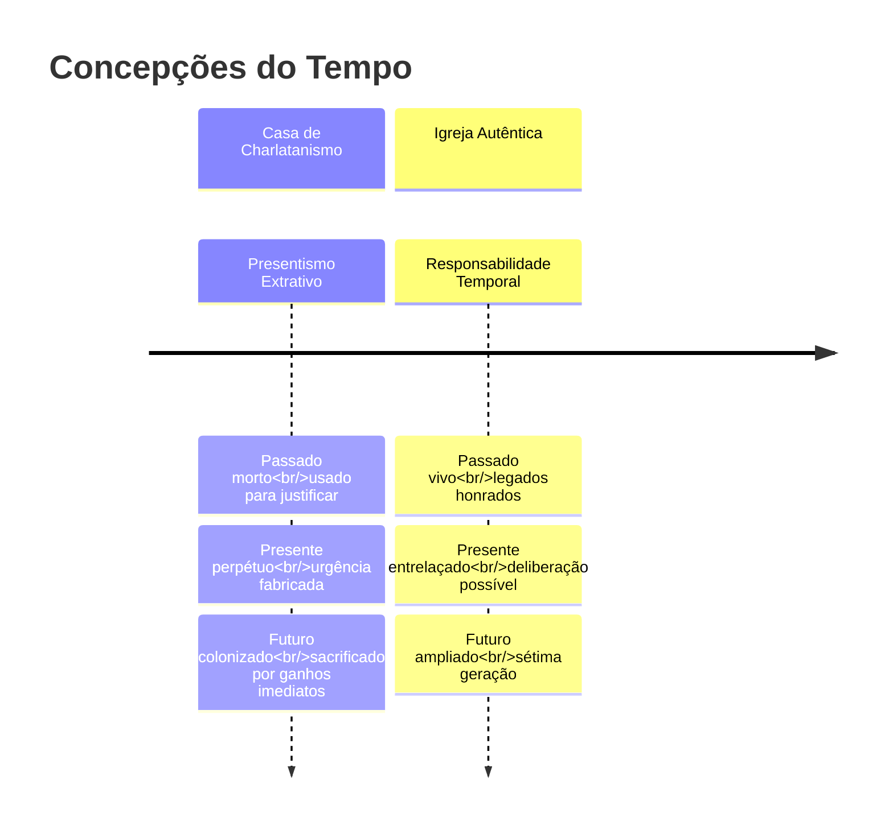
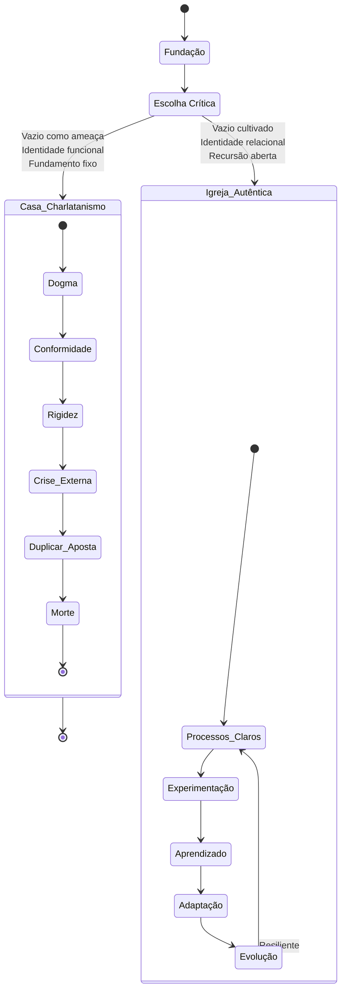
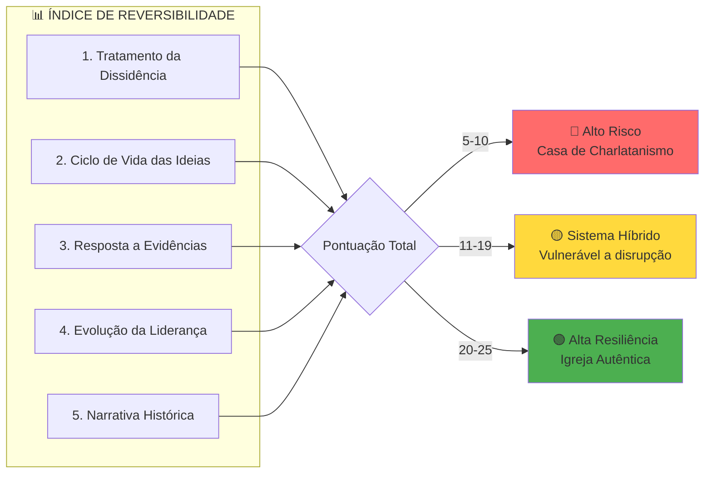
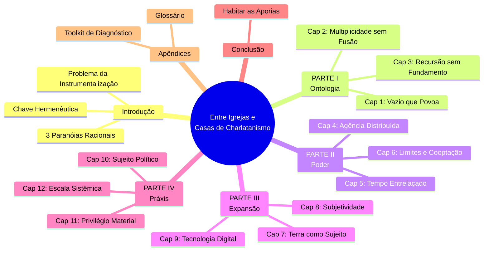
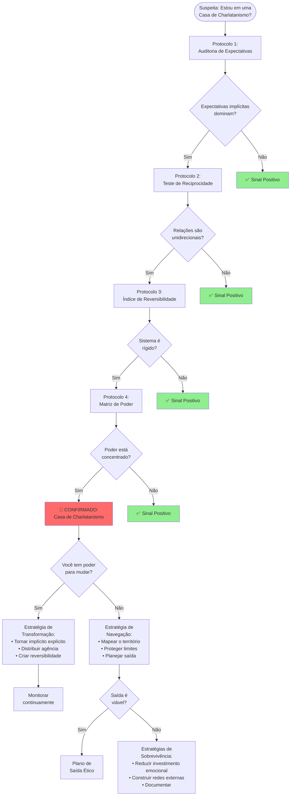
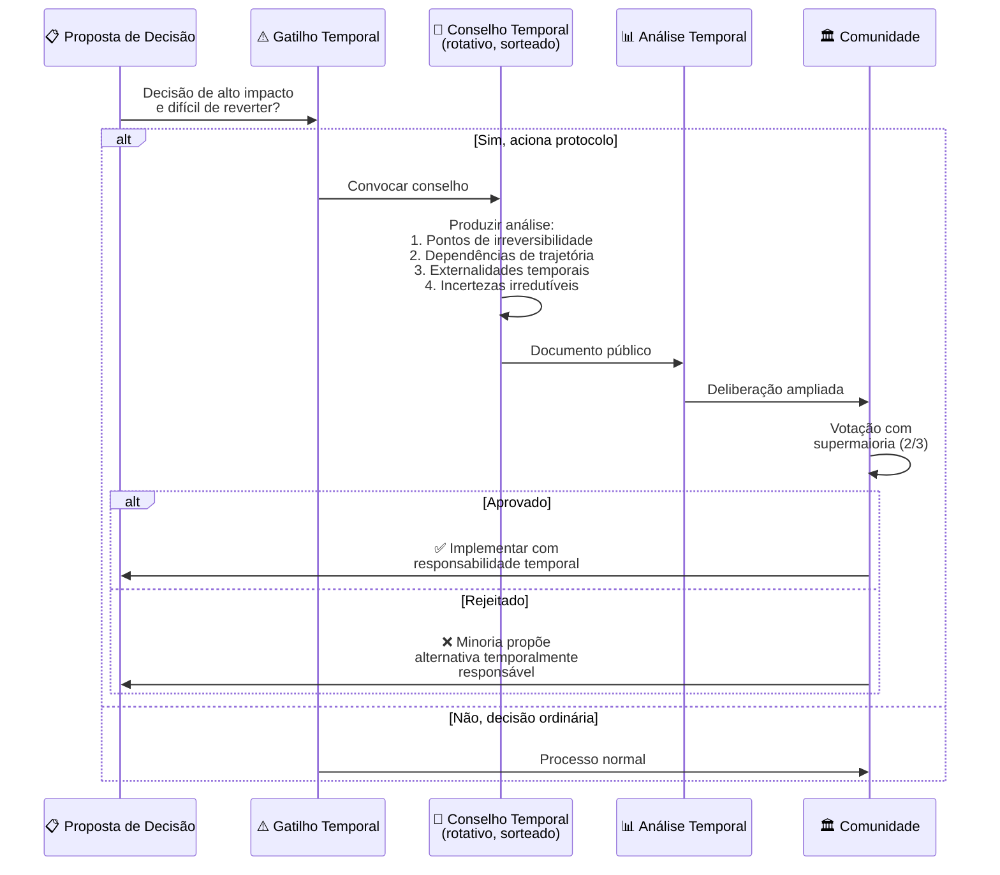

# Diagramas Mermaid - Entre Igrejas e Casas de Charlatanismo

## 1. Distinção Central: Igreja vs Casa de Charlatanismo

## 2. As Três Paranóias Racionais

## 3. Ontologia da Relacionalidade (Parte I)

## 4. Anatomia do Poder Relacional

## 5. Tempo: Presentismo vs Responsabilidade Temporal

## 6. Ciclo de Vida de uma Organização

## 7. Índice de Reversibilidade Paradigmática

## 8. Estrutura do Livro

## 9. Fluxo de Diagnóstico e Intervenção

## 10. Conselho de Sétima Geração (Protocolo Temporal)

---

## Como Usar Estes Diagramas

1. **Diagnóstico Pessoal**: Use o diagrama de fluxo (#9) para avaliar seu ambiente atual
2. **Educação em Equipe**: Use os diagramas conceituais (#1-3) para introduzir as ideias do livro
3. **Planejamento Estratégico**: Use o diagrama de poder (#4) e reversibilidade (#7) para avaliar sua organização
4. **Implementação de Protocolos**: Use os diagramas de processo (#10) como guias práticos

Todos os diagramas podem ser renderizados em:
- GitHub/GitLab (suporte nativo a Mermaid)
- Notion, Obsidian, VSCode (com extensões)
- [Mermaid Live Editor](https://mermaid.live)
