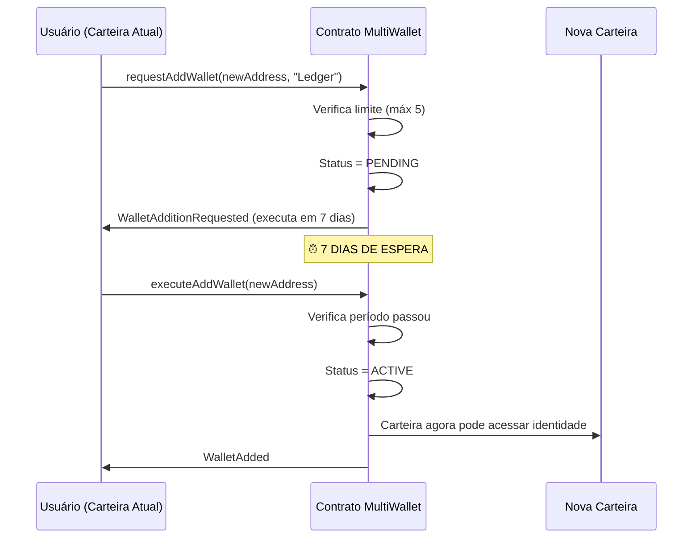
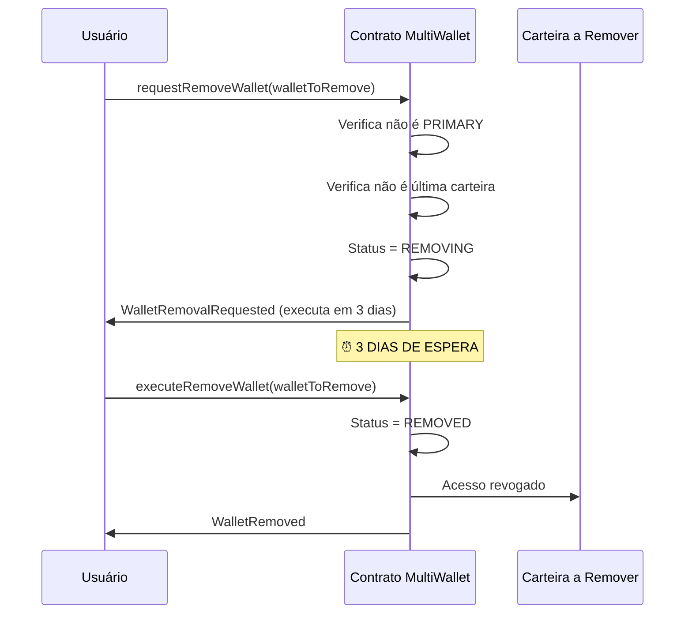
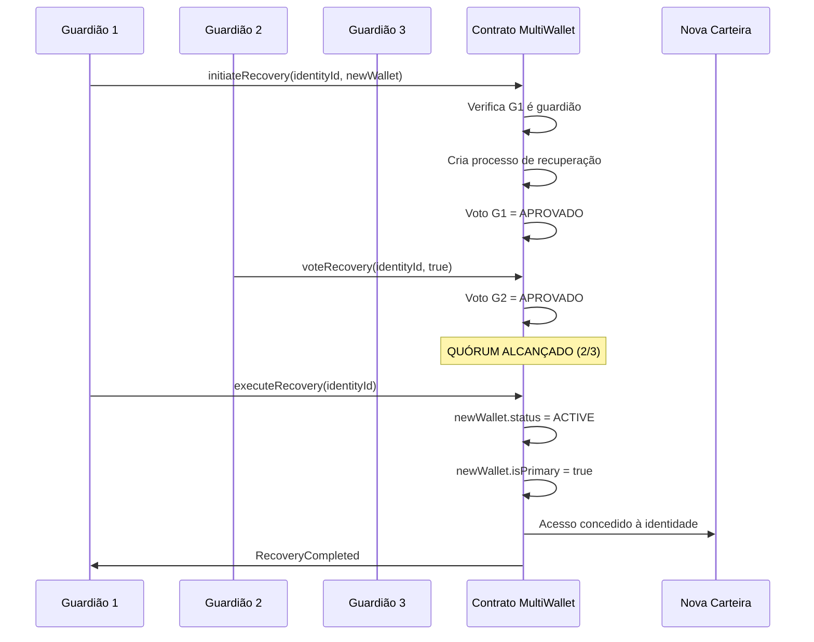

# BIP-0005: Multi-Wallet Recovery System

## Status
**Draft** - Proposta em discussão

## Autores
- Revolução Cibernética Core Team

## Data
02/11/2025

---

## Resumo Executivo

Este BIP propõe um sistema de **recuperação multi-carteira** que permite aos cidadãos vincular múltiplas carteiras à mesma identidade soberana, resolvendo o problema crítico de perda permanente de acesso por perda de chave privada.

**Problema central**: Na blockchain, perder a chave privada significa perder permanentemente:
- Identidade digital
- Tokens SOB acumulados
- Histórico de participação
- Direitos de voto

**Solução**: Sistema que permite vincular até 5 carteiras diferentes à mesma identidade, com mecanismos de segurança em camadas:
1. Período de espera para adicionar novas carteiras (7 dias)
2. Processo de confirmação para remover carteiras (3 dias)
3. Recuperação social através de guardiões (quórum 2/3)

---

## 1. Motivação

### 1.1 Problema Atual

#### Cenário 1: Perda de Dispositivo
```
Maria usa Metamask no computador
→ Computador roubado/quebrado
→ Não fez backup da seed phrase
→ PERDE TUDO: 5.000 SOB, identidade, histórico
→ Precisa criar nova identidade do zero
```

#### Cenário 2: Comprometimento de Carteira
```
João descobre que sua carteira foi comprometida
→ Precisa migrar para nova carteira urgentemente
→ Mas não pode transferir SOB (soulbound)
→ DILEMA: Manter carteira insegura ou perder tudo
```

#### Cenário 3: Evolução Tecnológica
```
Ana começou com carteira mobile (Trust Wallet)
→ Depois comprou hardware wallet (Ledger)
→ Quer usar Ledger para maior segurança
→ Mas não pode migrar identidade/SOB
→ FRUSTRAÇÃO: Presa à tecnologia antiga
```

### 1.2 Estatísticas Alarmantes

- **20% dos Bitcoin** estão em carteiras perdidas (~$140 bilhões)
- **35% dos usuários crypto** já perderam acesso a alguma carteira
- **1 em 5 carteiras** criadas nunca fazem backup adequado

**Fonte**: Chainalysis, 2024

### 1.3 Requisitos da Solução

1. ✅ **Flexibilidade**: Múltiplas carteiras por identidade
2. ✅ **Segurança**: Períodos de espera e confirmações
3. ✅ **Recuperação**: Sistema de guardiões sociais
4. ✅ **Usabilidade**: Fácil adicionar/remover carteiras
5. ✅ **Transparência**: Todas ações são auditáveis
6. ✅ **Privacidade**: Labels customizados, não expostos

---

## 2. Especificação Técnica

### 2.1 Arquitetura do Sistema

```
┌─────────────────────────────────────────────────┐
│         IDENTIDADE SOBERANA (ID único)          │
│                                                 │
│  ┌───────────────────────────────────────────┐ │
│  │         CARTEIRAS VINCULADAS              │ │
│  │  (Máximo: 5)                              │ │
│  ├───────────────────────────────────────────┤ │
│  │ 1. 0xABC... [PRIMARY] "PC Metamask"      │ │
│  │ 2. 0xDEF... [ACTIVE]  "Mobile Trust"     │ │
│  │ 3. 0x123... [ACTIVE]  "Ledger Hardware"  │ │
│  │ 4. 0x456... [PENDING] "Backup Wallet"    │ │
│  │ 5. 0x789... [ACTIVE]  "Family Emergency" │ │
│  └───────────────────────────────────────────┘ │
│                                                 │
│  ┌───────────────────────────────────────────┐ │
│  │      GUARDIÕES DE RECUPERAÇÃO             │ │
│  │  (Mínimo: 3, Quórum: 2/3)                │ │
│  ├───────────────────────────────────────────┤ │
│  │ • Guardião A (amigo confiável)           │ │
│  │ • Guardião B (familiar)                  │ │
│  │ • Guardião C (outro cidadão)             │ │
│  └───────────────────────────────────────────┘ │
└─────────────────────────────────────────────────┘
```

### 2.2 Estados de Carteira

```solidity
enum WalletStatus {
    Active,         // ✅ Ativa e válida
    Pending,        // ⏳ Aguardando período de 7 dias
    Removing,       // 🗑️ Em processo de remoção (3 dias)
    Removed         // ❌ Removida (não pode mais acessar)
}
```

### 2.3 Processo de Adição de Carteira



**Período de 7 dias** permite:
- Cancelar se adição foi acidente
- Detectar comprometimento (atacante não consegue adicionar carteira dele imediatamente)
- Outros donos da identidade reagirem

### 2.4 Processo de Remoção de Carteira



**Período de 3 dias** permite:
- Reverter remoção acidental
- Dar tempo para migrar dados
- Garantir que outras carteiras estão funcionando

### 2.5 Recuperação Social

Quando **todas as carteiras** são perdidas, sistema de guardiões entra em ação:



**Requisitos**:
- Mínimo 3 guardiões configurados
- Quórum de 2 aprovações (2/3)
- Processo expira em 7 dias
- Qualquer guardião pode iniciar

---

## 3. Casos de Uso Detalhados

### 3.1 Setup Inicial (Usuário Novo)

```javascript
// 1. Criar identidade com carteira principal (Metamask PC)
const identityId = await multiWallet.createIdentity(
    metamaskAddress,
    "PC Metamask"
);

// 2. Adicionar carteira mobile como backup
await multiWallet.requestAddWallet(
    trustWalletAddress,
    "Mobile Trust Wallet"
);

// Aguardar 7 dias...

await multiWallet.executeAddWallet(trustWalletAddress);

// 3. Configurar guardiões
await multiWallet.addGuardian(friendAddress);
await multiWallet.addGuardian(familyAddress);
await multiWallet.addGuardian(trustedCitizenAddress);

console.log("✅ Setup completo! Identidade protegida.");
```

### 3.2 Migração para Hardware Wallet

```javascript
// Usuário comprou Ledger, quer migrar

// 1. Adicionar Ledger como nova carteira
await multiWallet.requestAddWallet(
    ledgerAddress,
    "Ledger Nano X"
);

// 2. Aguardar 7 dias (segurança)
// ...

// 3. Ativar Ledger
await multiWallet.executeAddWallet(ledgerAddress);

// 4. Testar Ledger funciona
const identityId = await multiWallet.getIdentityId(ledgerAddress);
console.log("Identity accessible:", identityId);

// 5. Promover Ledger a carteira primária
await multiWallet.changePrimaryWallet(ledgerAddress);

// 6. Opcional: Remover carteira antiga (se comprometida)
await multiWallet.requestRemoveWallet(oldMetamaskAddress);
// Aguardar 3 dias...
await multiWallet.executeRemoveWallet(oldMetamaskAddress);
```

### 3.3 Recuperação de Emergência

```javascript
// Usuário perdeu TODAS as carteiras
// Guardiões iniciam recuperação

// GUARDIÃO 1: Inicia processo
await multiWallet.connect(guardian1).initiateRecovery(
    lostIdentityId,
    newWalletAddress  // Nova carteira do usuário
);

// GUARDIÃO 2: Aprova
await multiWallet.connect(guardian2).voteRecovery(
    lostIdentityId,
    true  // approve
);

// QUÓRUM ALCANÇADO! (2/3)

// Qualquer um pode executar
await multiWallet.executeRecovery(lostIdentityId);

// ✅ newWalletAddress agora controla identidade
```

### 3.4 Detecção de Comprometimento

```javascript
// Usuário suspeita carteira foi hackeada
// Usa outra carteira vinculada para remover a comprometida

// De outra carteira ativa:
await multiWallet.connect(safeWallet).requestRemoveWallet(
    compromisedWallet
);

// Aguardar apenas 3 dias (mais rápido que adicionar)
// ...

await multiWallet.connect(safeWallet).executeRemoveWallet(
    compromisedWallet
);

// 🔒 Carteira comprometida não pode mais acessar
```

---

## 4. Segurança

### 4.1 Vetores de Ataque e Mitigações

| Ataque | Descrição | Mitigação |
|--------|-----------|-----------|
| **Adicionar carteira maliciosa** | Atacante com acesso temporário adiciona sua carteira | ⏰ Período de 7 dias + notificação ao usuário |
| **Remover todas carteiras** | Atacante remove carteiras legítimas | 🛡️ Não pode remover última carteira + PRIMARY |
| **Roubo de identidade** | Atacante tenta assumir identidade via guardiões | 🔐 Quórum de 2/3 + guardiões confiáveis |
| **Replay attack** | Reusar assinatura para executar ação | ✅ Timestamps + nonces previnem replay |
| **DoS via spam** | Criar milhões de solicitações pendentes | 📊 Limite de 5 carteiras + gas cost |

### 4.2 Considerações Adicionais

#### Guarda Responsável de Chaves
```
RECOMENDAÇÕES:
1. Carteira Principal: Hardware wallet (Ledger/Trezor)
2. Backup 1: Mobile wallet com biometria
3. Backup 2: Carteira em cold storage (papel, cofre)
4. Emergency: Carteira com familiar confiável
5. Recovery: Carteira com amigo próximo
```

#### Guardiões
```
BOM:
✅ 3-5 pessoas que você confia completamente
✅ Distribuídas geograficamente
✅ Sabem que são guardiões (comunicação prévia)
✅ Têm incentivo para te ajudar

RUIM:
❌ Desconhecidos online
❌ Todos na mesma casa/cidade
❌ Não sabem que são guardiões
❌ Possível conflito de interesse
```

---

## 5. Integração com Outros Contratos

### 5.1 SovereignCurrency.sol

```solidity
// SovereignCurrency verifica MultiWallet antes de dar SOB

contract SovereignCurrency {
    MultiWalletIdentity public multiWallet;
    
    function earnCurrency(
        address citizen,
        ActivityType activity
    )
        external
        onlyRole(VALIDATOR_ROLE)
        whenNotPaused
    {
        // Obter identidade real
        bytes32 identityId = multiWallet.getIdentityId(citizen);
        require(identityId != bytes32(0), "No identity");
        
        // Verificar acesso válido
        require(
            multiWallet.canAccess(citizen, identityId),
            "Wallet not authorized"
        );
        
        // Continuar com lógica normal...
        // (dar SOB para identityId, não para citizen)
    }
}
```

### 5.2 ProofOfLife.sol

```solidity
// ProofOfLife aceita prova de qualquer carteira vinculada

contract ProofOfLife {
    MultiWalletIdentity public multiWallet;
    
    function submitProofOfLife(
        ProofMethod method,
        bytes memory proofData,
        bytes32 proofHash
    )
        external
        whenNotPaused
    {
        // Obter identidade
        bytes32 identityId = multiWallet.getIdentityId(msg.sender);
        require(identityId != bytes32(0), "No identity");
        
        // Verificar carteira ativa
        require(
            multiWallet.canAccess(msg.sender, identityId),
            "Wallet not active"
        );
        
        // Registrar prova para identidade
        citizens[identityId].lastProof = block.timestamp;
        // ...
    }
}
```

### 5.3 FederationVoting.sol

```solidity
// Votação usa MultiWallet para validar identidade

contract FederationVoting {
    MultiWalletIdentity public multiWallet;
    SovereignCurrency public sob;
    
    function vote(uint256 proposalId, uint8 option)
        external
    {
        // Obter identidade real
        bytes32 identityId = multiWallet.getIdentityId(msg.sender);
        require(identityId != bytes32(0), "No identity");
        
        // Verificar não votou ainda (por identidade, não carteira)
        require(!hasVoted[proposalId][identityId], "Already voted");
        
        // Obter poder de voto (SOB da identidade)
        uint256 votingPower = sob.getBalance(identityId);
        
        // Registrar voto
        hasVoted[proposalId][identityId] = true;
        // ...
    }
}
```

---

## 6. Experiência do Usuário

### 6.1 Interface (React + Web3)

```typescript
// Componente: WalletManager.tsx

interface LinkedWallet {
    address: string;
    status: 'Active' | 'Pending' | 'Removing' | 'Removed';
    label: string;
    isPrimary: boolean;
    addedAt: Date;
}

function WalletManager() {
    const { address } = useAccount();
    const [wallets, setWallets] = useState<LinkedWallet[]>([]);
    
    const loadWallets = async () => {
        const identityId = await multiWallet.getIdentityId(address);
        const addresses = await multiWallet.getWallets(identityId);
        
        const walletsData = await Promise.all(
            addresses.map(async addr => {
                const info = await multiWallet.getWalletInfo(identityId, addr);
                return {
                    address: addr,
                    status: info.status,
                    label: info.label,
                    isPrimary: info.isPrimary,
                    addedAt: new Date(info.addedAt * 1000)
                };
            })
        );
        
        setWallets(walletsData);
    };
    
    return (
        <div className="wallet-manager">
            <h2>Minhas Carteiras</h2>
            
            {wallets.map(wallet => (
                <WalletCard
                    key={wallet.address}
                    wallet={wallet}
                    onRemove={() => requestRemove(wallet.address)}
                    onMakePrimary={() => changePrimary(wallet.address)}
                />
            ))}
            
            {wallets.length < 5 && (
                <AddWalletButton onClick={openAddModal} />
            )}
            
            <GuardianManager identityId={identityId} />
        </div>
    );
}
```

### 6.2 Fluxo de Onboarding

```
NOVO USUÁRIO:

1. Conecta carteira (Metamask)
   ↓
2. Sistema cria identidade
   ↓
3. Tutorial: "Adicione carteiras de backup"
   ↓
4. Usuário adiciona 1-2 carteiras extras
   ↓
5. Tutorial: "Configure guardiões"
   ↓
6. Usuário escolhe 3 pessoas confiáveis
   ↓
7. ✅ Pronto! Identidade protegida
```

### 6.3 Notificações

```typescript
// Sistema de alertas automático

enum AlertType {
    WALLET_ADDITION_PENDING = "Carteira nova em 7 dias",
    WALLET_REMOVAL_PENDING = "Carteira será removida em 3 dias",
    RECOVERY_INITIATED = "Processo de recuperação iniciado!",
    GUARDIAN_VOTE_NEEDED = "Seu voto é necessário",
    LOW_WALLET_COUNT = "Adicione mais carteiras de backup",
    NO_GUARDIANS = "Configure guardiões para recuperação"
}

// Enviar via:
// - Push notification (mobile)
// - Email
// - SMS (emergências)
// - In-app notification
```

---

## 7. Custos

### 7.1 Gas Estimates

| Operação | Gas Estimado | Custo (20 gwei) |
|----------|--------------|-----------------|
| `createIdentity()` | ~180,000 | ~$0.90 |
| `requestAddWallet()` | ~120,000 | ~$0.60 |
| `executeAddWallet()` | ~80,000 | ~$0.40 |
| `requestRemoveWallet()` | ~90,000 | ~$0.45 |
| `executeRemoveWallet()` | ~70,000 | ~$0.35 |
| `changePrimaryWallet()` | ~60,000 | ~$0.30 |
| `addGuardian()` | ~100,000 | ~$0.50 |
| `initiateRecovery()` | ~150,000 | ~$0.75 |
| `voteRecovery()` | ~80,000 | ~$0.40 |
| `executeRecovery()` | ~140,000 | ~$0.70 |

**Total para setup completo** (1 identidade + 2 backups + 3 guardiões):
```
createIdentity: $0.90
+ 2x executeAddWallet: $0.80
+ 3x addGuardian: $1.50
= $3.20 total
```

**Muito acessível!** Menos de $5 para proteger identidade completamente.

### 7.2 Otimizações

```solidity
// Usar eventos para dados não-críticos
event WalletAdded(
    bytes32 indexed identityId,
    address indexed wallet,
    string label  // ❌ Storage caro
);

// Melhor: Armazenar off-chain
event WalletAdded(
    bytes32 indexed identityId,
    address indexed wallet
    // label vai em IPFS/Arweave
);

// Frontend reconstrói estado completo com:
// - Eventos on-chain
// - Metadata off-chain
```

---

## 8. Testes

### 8.1 Cenários de Teste

```solidity
// MultiWalletIdentity.t.sol

contract MultiWalletIdentityTest is Test {
    function testAddWallet() public {
        // Adicionar segunda carteira
        vm.prank(user1);
        multiWallet.requestAddWallet(user2, "Backup");
        
        // Não pode usar imediatamente
        vm.expectRevert("Wallet not active");
        multiWallet.connect(user2).doSomething();
        
        // Avançar 7 dias
        vm.warp(block.timestamp + 7 days);
        
        // Executar adição
        vm.prank(user1);
        multiWallet.executeAddWallet(user2);
        
        // Agora funciona
        bytes32 id = multiWallet.getIdentityId(user2);
        assertEq(id, identityId);
    }
    
    function testCannotRemoveLastWallet() public {
        vm.prank(user1);
        vm.expectRevert("Cannot remove last wallet");
        multiWallet.requestRemoveWallet(user1);
    }
    
    function testSocialRecovery() public {
        // Configurar guardiões
        vm.prank(user1);
        multiWallet.addGuardian(guardian1);
        multiWallet.addGuardian(guardian2);
        multiWallet.addGuardian(guardian3);
        
        // Guardião 1 inicia recuperação
        vm.prank(guardian1);
        multiWallet.initiateRecovery(identityId, newWallet);
        
        // Guardião 2 aprova
        vm.prank(guardian2);
        multiWallet.voteRecovery(identityId, true);
        
        // Executar (quórum alcançado)
        multiWallet.executeRecovery(identityId);
        
        // Verificar nova carteira funciona
        bytes32 id = multiWallet.getIdentityId(newWallet);
        assertEq(id, identityId);
    }
    
    function testAttackerCannotAddWallet() public {
        // Atacante tenta adicionar carteira dele
        vm.prank(attacker);
        vm.expectRevert("No identity found");
        multiWallet.requestAddWallet(attackerWallet, "Evil");
    }
}
```

---

## 9. Roadmap de Implementação

### Fase 1: MVP (2 semanas)
- [x] Contrato MultiWalletIdentity.sol
- [x] Testes básicos
- [ ] Deploy em testnet
- [ ] Interface web simples

### Fase 2: Integração (2 semanas)
- [ ] Integrar com SovereignCurrency
- [ ] Integrar com ProofOfLife
- [ ] Integrar com FederationVoting
- [ ] Migrar identidades existentes

### Fase 3: UX (2 semanas)
- [ ] Interface completa (React)
- [ ] Sistema de notificações
- [ ] Onboarding tutorial
- [ ] Mobile app (React Native)

### Fase 4: Produção (2 semanas)
- [ ] Auditoria de segurança
- [ ] Deploy mainnet
- [ ] Documentação completa
- [ ] Campanha educacional

---

## 10. Perguntas Frequentes

### P: Quantas carteiras devo adicionar?

**R:** Recomendamos **pelo menos 3**:
1. Principal (uso diário)
2. Backup (outro dispositivo)
3. Emergência (cold storage ou familiar)

### P: Posso adicionar carteira de outra pessoa?

**R:** Tecnicamente sim, mas **não recomendado**. Essa pessoa terá acesso total à sua identidade. Use apenas para emergências (familiar muito confiável).

### P: E se eu perder todas as carteiras E os guardiões?

**R:** Infelizmente, **não há recuperação**. Por isso:
- Mantenha pelo menos 1 carteira em cold storage
- Escolha guardiões duradouros
- Faça backup das seeds phrases

### P: Atacante pode adicionar carteira dele se hackear minha carteira atual?

**R:** Não imediatamente. Tem **7 dias de espera**. Nesse período:
- Você recebe notificações
- Pode cancelar com outra carteira
- Pode remover carteira comprometida

### P: Quanto custa adicionar carteira?

**R:** ~$1 em gas fees (muito barato!)

### P: Posso ter carteiras em diferentes blockchains?

**R:** Nesta versão, não. Mas futuro suporte a:
- Polygon (Layer 2)
- Arbitrum
- Outros EVMs

---

## 11. Conclusão

O **Multi-Wallet Recovery System** resolve um dos maiores problemas da blockchain: **perda permanente de acesso**.

### Benefícios Principais:

1. 🔐 **Segurança**: Múltiplos pontos de acesso
2. 🛡️ **Resiliência**: Perder 1 carteira não é catastrófico
3. 🔄 **Flexibilidade**: Migrar entre tecnologias
4. 👥 **Recuperação Social**: Guardiões para emergências
5. 💰 **Baixo Custo**: ~$3 para setup completo

### Comparação com Outras Soluções:

| Solução | Multi-Wallet | Social Recovery (Argent) | Multisig (Gnosis) |
|---------|--------------|--------------------------|-------------------|
| Complexidade | ⭐⭐ Média | ⭐⭐⭐ Alta | ⭐⭐⭐⭐ Muito Alta |
| Custo Setup | $3 | $5-10 | $20-50 |
| Custo Uso | Baixo | Médio | Alto (cada transação) |
| Recuperação | ✅ Guardiões | ✅ Guardiões | ✅ Co-signers |
| Usabilidade | ✅✅ Excelente | ✅ Boa | ❌ Complexa |
| Blockchain | Ethereum | Ethereum, L2s | Qualquer |

**Multi-Wallet vence** em equilíbrio custo-benefício e usabilidade.

---

## 12. Referências

1. **Chainalysis** (2024): "The State of Lost Cryptocurrencies"
2. **Argent Wallet**: Social recovery implementation
3. **Gnosis Safe**: Multi-signature wallets
4. **EIP-4337**: Account abstraction standard
5. **Vitalik Buterin**: "Why we need wide adoption of social recovery wallets"

---

## Anexo A: Exemplo Completo

```javascript
// ===================================
// EXEMPLO COMPLETO DE USO
// ===================================

const { ethers } = require("hardhat");

async function main() {
    // 1. DEPLOY
    const MultiWallet = await ethers.getContractFactory("MultiWalletIdentity");
    const multiWallet = await MultiWallet.deploy();
    
    console.log("✅ MultiWallet deployed:", multiWallet.address);
    
    // 2. CRIAR IDENTIDADE
    const [admin, user, backup1, backup2, emergency, g1, g2, g3] = await ethers.getSigners();
    
    await multiWallet.grantRole(
        await multiWallet.VALIDATOR_ROLE(),
        admin.address
    );
    
    const tx1 = await multiWallet.createIdentity(
        user.address,
        "Primary Metamask"
    );
    
    const receipt1 = await tx1.wait();
    const identityId = receipt1.events[0].args.identityId;
    
    console.log("✅ Identity created:", identityId);
    
    // 3. ADICIONAR BACKUPS
    await multiWallet.connect(user).requestAddWallet(
        backup1.address,
        "Mobile Trust Wallet"
    );
    
    await multiWallet.connect(user).requestAddWallet(
        backup2.address,
        "Ledger Hardware"
    );
    
    console.log("⏳ Waiting 7 days...");
    await ethers.provider.send("evm_increaseTime", [7 * 24 * 60 * 60]);
    await ethers.provider.send("evm_mine");
    
    await multiWallet.connect(user).executeAddWallet(backup1.address);
    await multiWallet.connect(user).executeAddWallet(backup2.address);
    
    console.log("✅ Backups added");
    
    // 4. CONFIGURAR GUARDIÕES
    await multiWallet.connect(user).addGuardian(g1.address);
    await multiWallet.connect(user).addGuardian(g2.address);
    await multiWallet.connect(user).addGuardian(g3.address);
    
    console.log("✅ Guardians configured");
    
    // 5. TESTAR ACESSO DE MÚLTIPLAS CARTEIRAS
    const id1 = await multiWallet.getIdentityId(user.address);
    const id2 = await multiWallet.getIdentityId(backup1.address);
    const id3 = await multiWallet.getIdentityId(backup2.address);
    
    console.log("IDs match:", id1 === id2 && id2 === id3);
    
    // 6. SIMULAR PERDA E RECUPERAÇÃO
    console.log("\n🚨 SIMULATING TOTAL LOSS...");
    
    // Guardião 1 inicia
    await multiWallet.connect(g1).initiateRecovery(
        identityId,
        emergency.address
    );
    
    // Guardião 2 aprova
    await multiWallet.connect(g2).voteRecovery(identityId, true);
    
    // Executar
    await multiWallet.executeRecovery(identityId);
    
    console.log("✅ RECOVERY COMPLETE!");
    
    // Nova carteira funciona
    const recoveredId = await multiWallet.getIdentityId(emergency.address);
    console.log("Emergency wallet has access:", recoveredId === identityId);
    
    // 7. ESTATÍSTICAS FINAIS
    const wallets = await multiWallet.getWallets(identityId);
    const guardians = await multiWallet.getGuardians(identityId);
    
    console.log("\n📊 FINAL STATE:");
    console.log("- Total Wallets:", wallets.length);
    console.log("- Total Guardians:", guardians.length);
    console.log("- Identity Protected: ✅");
}

main()
    .then(() => process.exit(0))
    .catch(error => {
        console.error(error);
        process.exit(1);
    });
```

---

**Versão**: 1.0  
**Última Atualização**: 02/11/2025  
**Status**: Draft para revisão comunitária
